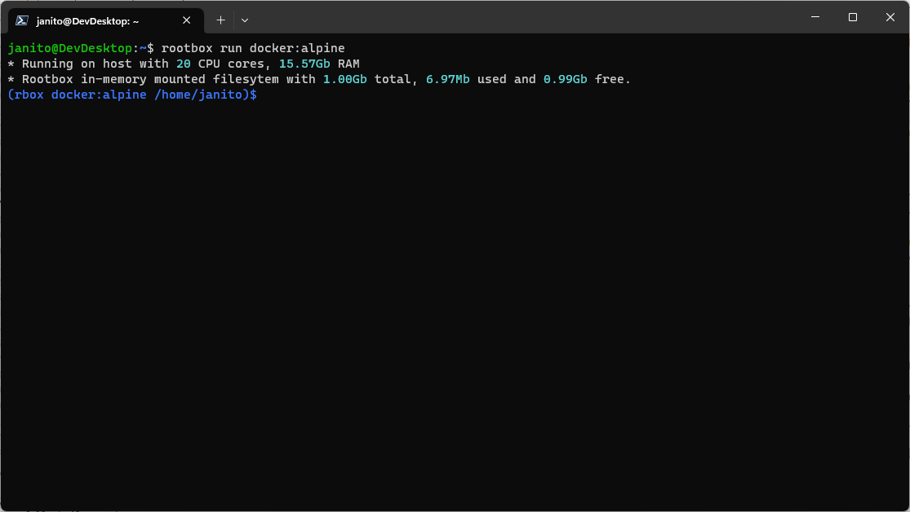

# rootbox

[](https://pypi.python.org/pypi/rootbox)

[](https://github.com/ambv/black)

## What is rootbox?

Rootbox is a tool for Linux and WSL that allows regular (unprivileged) users to deploy applications in a portable and reproducible way.




## How does it work
Rootbox uses Linux kernel namespaces to create contained environments.

## What is the difference between rootbox and Docker?
The focus of rootbox is to provide a tool that can be used to run applications without the need to install dependencies on the host system. Rootbox does **NOT** aim to provide full isolation between environemtns and the host, for such use cases please consider using Docker or Podman.

## What is nedded to run rootbox?
- A Linux distrubtion or Linux on Windows with WSL (Kernel version >=4.18)
- Python 3.8, 3.9, 3.10 or 3.11
- Only 64-bit architectures are supported

## What applications can I run with rootbox?

- images from the Linux Containers project ([LXC](https://https://images.linuxcontainers.org/)).
- images from the Docker Hub registry ([Docker Hub](https://hub.docker.com/))

## Supported package managers

| Status | Tool | Distros |
|:------:|------|---------|
|✅|apk|Alpine|
|✅|pacman|ArchLinux|
|✅|dnf|Alma; CentOS; Fedora; Rocky|
|✅|xbps|VoidLinux|
|✅|zypper|openSUSE|
|❌|apt|Debian/Ubuntu|

## How to install
```sh
pip install rootbox
```
## How to use

List all the distributions available from the LXC project
```sh
# Check the list of supported distro names in the table above
rootbox lxc list
```

### Run an in-memory single run container
Run a shell in an Alpine Linux container
```sh
rootbox run lxc:alpine:3.17
```
Check the apk version:
```sh
rootbox run lxc:alpine:3.17 "apk --version"
```

### Create an in-memory multi run container
```sh
rootbox create lxc:alpine:3.17
```
### Execute a command in a container
```sh
rootbox execute lxc:alpine:3.17 "apk --version"
```
